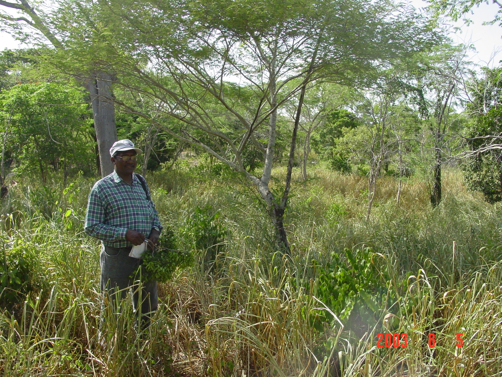

```{r setup, include=FALSE}
knitr::opts_chunk$set(echo = FALSE)
```

```{css, include=FALSE}
  .reveal p {
    text-align: left;
  }
  .reveal ul {
    display: block;
  }
  .reveal ol {
    display: block;
  }  
```

# ¿Por qué fuego y deforestación?

- Se supone que están relacionados, ¿no? Buej, ese es el punto.


##


##


# ¿Qué sabemos?

- Que __hemos perdido más__ de lo que hemos ganado [@hansen2013high; @Lloyd558346].

- Que el fuego como __impulsor__ de la deforestación lo es sobre todo en el __pinar__ [@Lloyd558346].

- Que hay una __relación__ estrecha entre entre __pérdida de bosque y agricultura migratoria__, esta última dirigida por prácticas de __roza y quema__ [@camara1997republica; @zweifler1994landuse; @Lloyd558346; @wendell1974agricultura; @ovalle1984analisis; @panamericana1967reconocimiento; @tolentino1998inventario; @myers2004evaluacion].

# Fuego y deforestación

- El __fuego__ es, frecuentemente, un __proxy de agricultura__ de subsistencia y de agricultura migratoria.

- Pero,

  - __no toda esta agricultura__ se relaciona sólo con el fuego,
  
  - __ni todo el fuego__ se debe a esta agricultura.

- Y, respecto de la deforestación,

  - __no todo fuego__ impulsa deforestación,
  
  - __ni toda la deforestación__ se asocia con fuego.

## Fuego y deforestación

- De ahí que **medir el grado de asociación *niankesea* "estadística", entre fuego y deforestación, sea crucial**.

- PERO, __con las fuentes nacionales esto no es posible__, porque,

  - o no son consistentes espacial y/o temporalmente,
  
  - o usan unidades territoriales inhomogéneas.

## Fuego y deforestación

- Pero hay opciones.


## Fuego y deforestación

- Ya tenemos los datos idóneos, pero surge otro problema: un simple análisis de correlación con datos espacializados normalmente es inviable porque se **viola el principio de independencia de las observaciones** (e.g. datos autocorrelacionados espacialmente).

- También tenemos la solución: **modelos espaciales autorregresivos**.

## 


XKCD comics: https://xkcd.com/1831/

# ¿Qué me planteé?

- **Determinar si existe asociación entre fuego y deforestación y, si existe, qué tan fuerte es y dónde**.

- "Ya que" se procesarían millones de celdas, "de paso",

  - determinar si hay zonas de __concentración significativa__ del fuego y la deforestación,
  
  - caracterizar la __composición de la deforestación__ según el tamaño de las zonas deforestadas,
  
  - determinar si hay alguna __tendencia__ sostenida.

- Y respecto de __Valle Nuevo, ¿qué? Pues, todo lo anterior__.

# ¿Dónde están los resultados?

{width=70%}

<small>https://www.biorxiv.org/content/10.1101/2021.06.15.448604v1.full</small>

##


<small>https://github.com/geofis/forest-loss-fire-reproducible/data-download-preparation-eda.pdf</small>

## 


<small>https://github.com/geofis/forest-loss-fire-reproducible/data-download-preparation-eda.pdf</small>

## 


<small>https://github.com/geofis/forest-loss-fire-reproducible/data-download-preparation-eda.pdf</small>

## 


<small>https://github.com/geofis/forest-loss-fire-reproducible/data-download-preparation-eda.pdf</small>

# ¿Cómo maomeno?

- Cumpliendo los siguientes criterios:

  - Usando software libre.
  
  - Usando datos abiertos.
  
  - Creando script reproducible.

{width=75%}

## ¿Cómo maomeno?


## ¿Cómo maomeno?


## ¿Cómo maomeno?


## ¿Cómo maomeno?


# ¿Qué encontré?


#



# Gracias por su atención

Vínculo de la presentación

https://geofis.github.io/fd-vn

# Referencias

##
